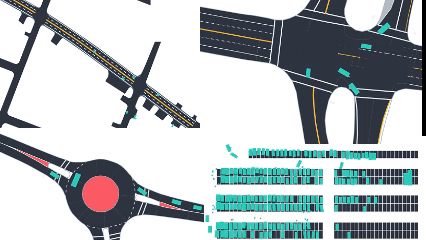

# About Me

My name is Mingyang Jiang, and I am a second-year master's student at the School of Electronic Information and Electrical Engineering, Shanghai Jiao Tong University. My research interests include robot learning, motion planning, and autonomous navigation, with a particular focus on integrating learning-based methods into robotic systems. I earned my bachelor's degree in Artificial Intelligence from the same school, graduating strong academic record.

I am fortunate to be advised by [Prof. Ming Yang](https://scholar.google.com/citations?user=0TCYA3YAAAAJ&hl=zh-CN&oi=ao) at the [CyberC3 Intelligent Vehicle Lab](https://cyberc3.sjtu.edu.cn/) (in Chinese). I also collaborate closely with [Prof. Songan Zhang](https://gift.sjtu.edu.cn/zsa_en/main.htm) from the Global Institute of Future Technology, Shanghai Jiao Tong University.

You can find my CV here: [Mingyang Jiang's Curriculum Vitae](../assets/Curriculum_Vitae.pdf).

## Research
<h3 style="margin-bottom: 5px;">Motion Planning for Mobile Robots in Confined Spaces</h3>

  

    
    
Parking Planning

  

  

    
    
Escape Planning

  

  

    
    
Lidar OGM-Based Planner

  

<h3 style="margin-bottom: 5px;">Integrated Perception and Planning in Dynamic Environment</h3>

  

    
    
Tactics2d: Driving Simulator

  

  

    
    
World-Model-Based Driving

  

  

    
    
End-to-End Vehicle Following

  

