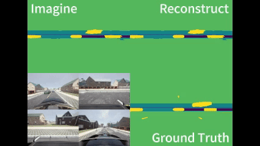

# About Me

My name is Mingyang Jiang, and I am a second-year master's student at the School of Electronic Information and Electrical Engineering, Shanghai Jiao Tong University. My research interests include robot learning, motion planning, and autonomous navigation, with a particular focus on integrating learning-based methods into robotic systems. I earned my bachelor's degree in Artificial Intelligence from the same school, graduating with strong academic record.

I am fortunate to be advised by [Prof. Ming Yang](https://scholar.google.com/citations?user=0TCYA3YAAAAJ&hl=zh-CN&oi=ao) at the [CyberC3 Intelligent Vehicle Lab](https://cyberc3.sjtu.edu.cn/) (in Chinese). I also collaborate closely with [Prof. Songan Zhang](https://scholar.google.com/citations?hl=en&user=YnSPFY8AAAAJ) and [Yueyuan Li](https://scholar.google.com/citations?hl=en&user=GcxEMNIAAAAJ), who have provided invaluable guidance in my research. I have also collaborated on research projects with [Prof. Tong Qin](https://scholar.google.com/citations?hl=en&user=TcLL048AAAAJ) and [Prof. Yeqiang Qian](https://scholar.google.com/citations?hl=en&user=CzuDD9AAAAAJ).

You can find my CV here: [Mingyang Jiang's Curriculum Vitae](../assets/Curriculum_Vitae.pdf).

<h2 style="margin: 10px 0;">Research</h2>

<h3 style="margin: 5px 0;">Motion Planning for Mobile Robots in Confined Spaces</h3>

  

    
    
Parking Planning

  

  

    
    
Escape Planning

  

  

    
    
Lidar OGM-Based Planner

  

<h3 style="margin: 5px 0;">Integrated Perception and Planning in Dynamic Environment</h3>

  

    
    
Tactics2d: Driving Simulator

  

  

    
    
World-Model-Based Driving

  

  

    
    
End-to-End Vehicle Following

  

---

### HOPE: A Reinforcement Learning-based Hybrid Policy Path Planner for Diverse Parking Scenarios  
**Mingyang Jiang**†,, Yueyuan Li†,, Songan Zhang, Siyuan Chen, Chunxiang Wang, and Ming Yang  
(Accepted by) IEEE Transactions on Intelligent Transportation Systems (T-ITS), 2025  
[Paper](https://arxiv.org/abs/2405.20579) | [Video](https://www.youtube.com/watch?v=62w9qhjIuRI) | [Code](https://github.com/jiamiya/HOPE) | [PaperWithCode](https://paperswithcode.com/paper/hope-a-reinforcement-learning-based-hybrid)

---

### Embodied Escaping: End-to-End Reinforcement Learning for Robot Navigation in Narrow Environment  
Han Zheng†,, Jiale Zhang†,, **Mingyang Jiang**, Peiyuan Liu, Danni Liu, Tong Qin, and Ming Yang  
(Submitted to) IEEE/RSJ International Conference on Intelligent Robots and Systems (IROS), 2025  
[Paper](https://arxiv.org/abs/2503.03208) | [Video](https://youtu.be/kBaaYWGhNuE)

---

### Lidar OGM-Based Hybrid Reinforcement Learning Planner for Autonomous Parking  
Zhitao Wang†,, Zhe Chen†,, **Mingyang Jiang**, Tong Qin, Ming Yang  
(Accepted by) IEEE International Conference on Robotics and Automation (ICRA), 2025  
[Paper](https://arxiv.org/abs/2502.18846)

---

### Tactics2D: A Highly Modular and Extensible Simulator for Driving Decision-Making  
Yueyuan Li, Songan Zhang, **Mingyang Jiang**, Xingyuan Chen, Yeqiang Qian, Chunxiang Wang, Ming Yang  
(Published at) IEEE Transactions on Intelligent Vehicles (T-IV), 2024  
[Paper](https://ieeexplore.ieee.org/abstract/document/10561544) | [Code](https://github.com/WoodOxen/tactics2d) | [Website](https://tactics2d.readthedocs.io/en/latest/)

---

### End-to-end Driving in High-Interaction Traffic Scenarios with Reinforcement Learning  
Yueyuan Li†,, **Mingyang Jiang**†,, Songan Zhang, Wei Yuan, Chunxiang Wang, and Ming Yang  
(Under progress) arXiv preprint arXiv:2410.02253  
[Paper](https://arxiv.org/abs/2410.02253)

---

### All You Need Is One Camera: An End-to-end Autonomous Driving Framework for Vehicle Following  
Jiale Zhang, Yeqiang Qian, Tong Qin, **Mingyang Jiang**, Siyuan Chen, and Ming Yang  
(Under progress)  
[Video](https://www.youtube.com/watch?v=zL1bcVb9kqQ)

*(†: Co-first author)*

